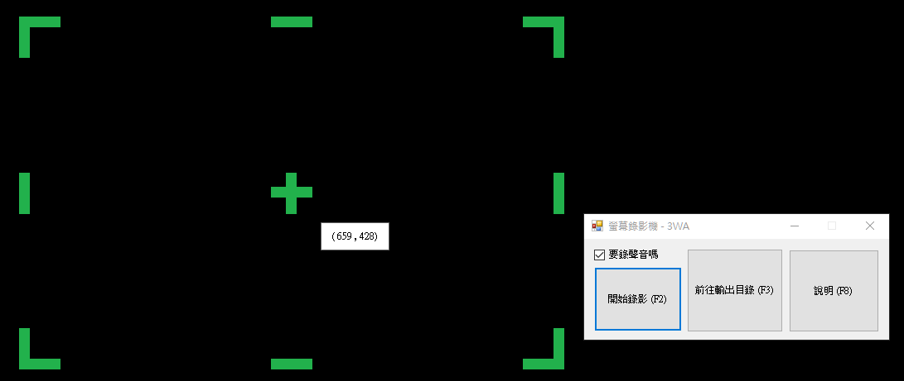

# my_cam
標題：我的自製簡易版桌面錄影 
作者：羽山秋人 (http://3wa.tw) 
版本：V1.0 (2019-06-23) 
 
 
相關技術： 
AviFile 將影片檔與聲音檔結合 
Accord 利用裡面的 ffmpeg 來合併截取的圖片 
CaptureScreen 包含截取滑鼠位置 
NAudio 錄桌面聲音 

  
   
  操作界面

 
Todo： 
  (Done 2019-06-23) 1. 初版發行 
  (Done 2019-06-30) 2. 影格跟聲音有些不同步 
  (Done 2019-06-30) 3. 連續錄影時間一長，儲存完成的檔案無法播放 
  4. 影片的大小有點太大
  5. 畫面變化多時，會吃過多的 CPU
  6. 尚未接收麥克風的聲音

